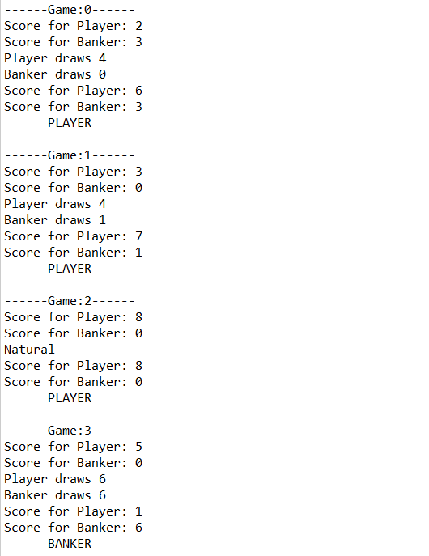
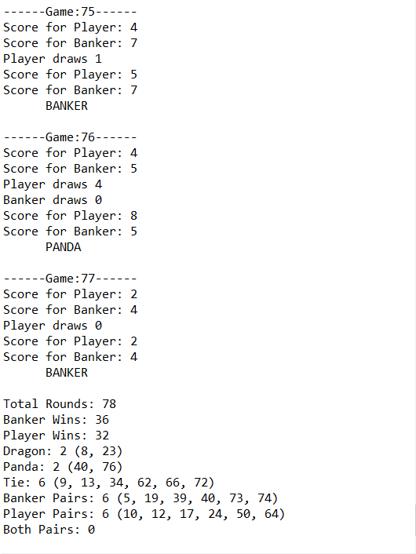

# Baccarat

Baccarat is a card game played in casino. Search for the rule of the game if interested.

This program's main purpose is to simulate a game of Baccarat (8 decks of cards, around 75-85 rounds), display result for each round, 
and tallies result into statistics at the end for further analysis. 

Here is an example of how the output looks like:

Beginning of output | [...] | End of output
------------------- | ----- | -------------
 | [...] | 

Each round of game displays intial score of player's and banker's hand.

If draw/hit condition is met, player/banker draws a card.

Then the program compares the score, annouces the result of that round (PLAYER/BANKER/TIE/PANDA/DRAGON).

At the end of the program, statistics on number of rounds, number of banker/player wins, special conditions (TIE/DRAGON/PANDA/PAIRS) 
and their round of occurence are shown for further analysis.

